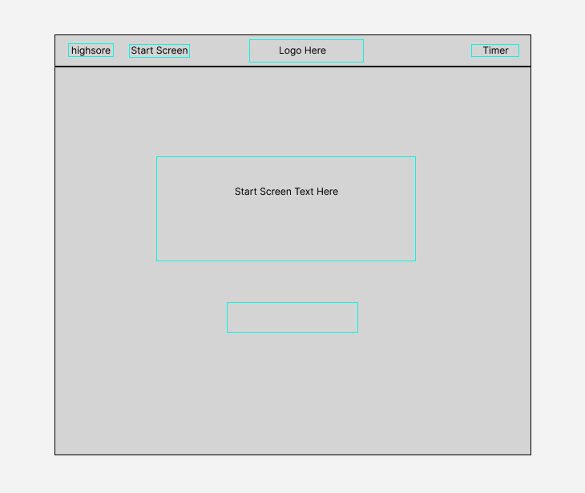
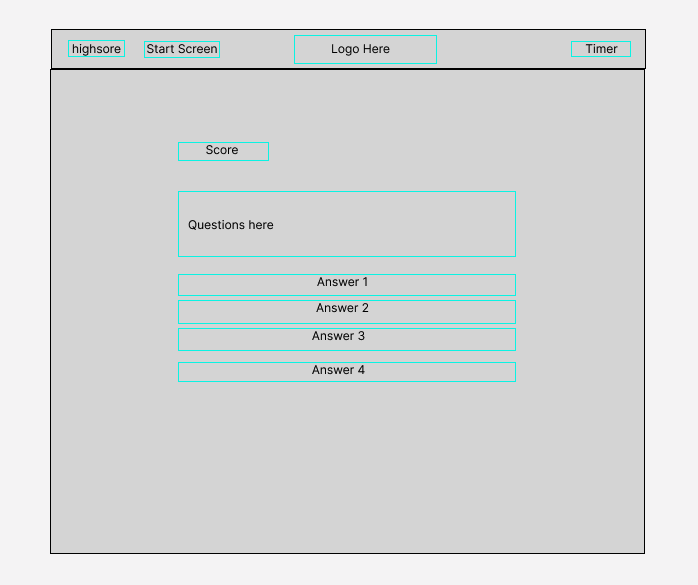
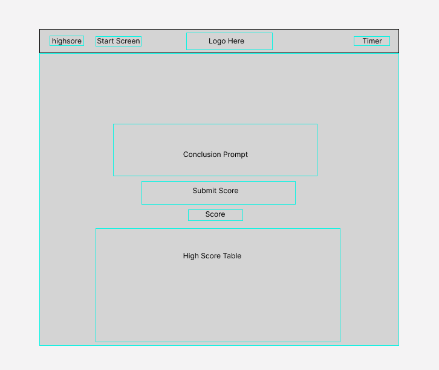

# CodingQuiz

## Description

Creating this Coding Quiz, I had the desire to make something that was a fun, interactive way to test the knowledge that I currently have in coding and, also give users to ability to test their knowledge in coding so that they may learn their strengths and weaknesses. Building this project was a great way to practice JavaScript web API's in my programs to make a simple quiz application come to life. I built this project because I could later down the line use it as a resource to help teach others to study and prepare for coding knowledge tests. From making this project, I learned how to implement a lot of important fundamentals about web API's and make all my key learnings work harmoniously with one another to create simple applications. I've become very knowledgeable with local storage, accessing object indexes, setting time intervals, and dynamically creating web page content through JavaScript with the production of this app.

## Feature

* I have added a timer to the quiz to put extra pressure on users and make it a fun experience. If the timer runs out before the user finishes, the quiz ends

* There is a scoring system that rewards players with 10 points for each correct answer, but also punishes players for giving the wrong answer by taking away 10 seconds from the time

* The quiz generates a randomly mixed array of questions each time to keep players guessing about the next question

* Users score is kept track of and at the end of the quiz, allows users to save their score among a list of high scores where it will be stored in local storage

* All displays are loaded with the use of one HTML

* High scores are sorted by highest score

## Usage

The way this project is to be used is to open the main screen of the project and start the quiz. The user must then answer the questions one by one to the best of their ability. The user can then store their score in the high score list. If they didn't perfect it, they can go study some more, and come back to the quiz where their score is still stored and try to beat it.

## Demo

This is the functionality of my quiz app

## Wire Frames 

## Deployed Application

Check out the live website here: https://keysbhag.github.io/CodingQuiz/

## Credits

Keyshawn Bhagwandin Git Repo: https://github.com/keysbhag/CodingQuiz

## License

N/A

---
© 2022 Keysbhag. Confidential and Proprietary. All Rights Reserved.

